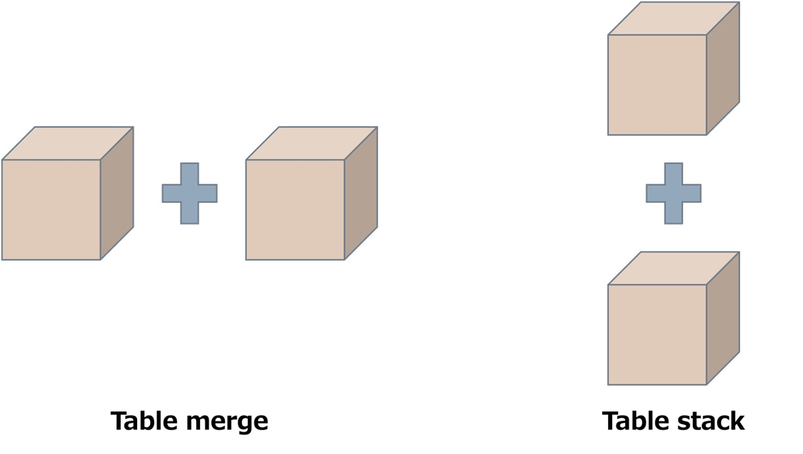

```{r setup, include=FALSE}
knitr::opts_chunk$set(echo = TRUE)
```

# Motivation

```{r, fig.align = 'center', fig.cap = "Image source: https://www.nature.com/news/1-500-scientists-lift-the-lid-on-reproducibility-1.19970", echo=FALSE}

```

* The replication crisis (also called the replicability crisis and the reproducibility crisis) is an ongoing methodological crisis in which the results of many scientific studies are difficult or impossible to reproduce

* Reproducible crisis lead to
  + Low quality of medical research
  + low quality code and contain errors
  + Reproducibility is frequently laborious and time-consuming.

```{r raw data, fig.align = 'center', fig.cap = "**Raw data to summary table**", echo=FALSE}

```

```{r, fig.align = 'center', fig.cap = "**SPSS output to summary table**", echo=FALSE}

```

```{r, fig.align = 'center', fig.cap = "**R output to summary table**", echo=FALSE}

```

* Thus, gtsummary package were developed to help the non-coder R users to produce a presentation ready table that are reproducible and customizable. 

```{r, fig.align = 'center', fig.cap = "Image source: Happy R adapted from artwork by @allison_horst; the beach and cocktail images are from pngtree.com", fig.dim=c(8,6), echo=FALSE}


```
# Introduction

```{r, fig.align = 'center', fig.cap = "", echo=FALSE}

```

```{r, fig.align = 'center', fig.cap = "", echo=FALSE}

```

# Overview of {gtsummary} package 

* The {gtsummary} package provides an elegant and flexible way to create publication-ready analytical and summary tables using the R programming language.
* A package developed by Daniel D.Sjoberg et al. 
* Use gt package as a background to produced a highly reproducible and presentation ready table.
* Latest version: 1.7.2 (2023-07-15)
* Requirement: R ≥ 3.4

##  Import Packages

|       |                                    |                              |
|---------------------------|------------------------------------|------------------------------|
|      broom (>= 0.8.0)     |      broom.helpers   (>= 1.9.0)    |      cli (>= 3.1.1)          |
|      dplyr (>= 1.0.7)     |      forcats (>= 0.5.1)            |      glue (>= 1.6.0)         |
|      gt (>= 0.7.0)        |      knitr (>= 1.37)               |      lifecycle (>= 1.0.1)    |
|      purrr (>= 0.3.4)     |      rlang (>= 1.0.3)              |      stringr (>= 1.4.0)      |
|      tibble (>= 3.1.6)    |      tidyr (>= 1.1.4)              |                              |

## Function

* Creates default **tabular summaries** with **highly customizable** capabilities
* Summarize data frames (survival data, survey data)
* Cross-tabulation
* Summarize regression models (linear, logistics and survival)
* Report statistics from **gtsummary** tables in-line in Rmarkdown
* Stack and /or merge any table type
* Standardize themes across tables
* Choose different print engines

# Analysis Workflow

| **Function**         | **Customization**  |                          |                   | **Print engines** | **Theme**                                                                         |
|----------------------|--------------------|--------------------------|-------------------|-------------------|-----------------------------------------------------------------------------------|
| *gtsummary function* | *Data arrangement* | *Additional information* | *Table cosmetics* | *coding*          | *coding*                                                                          |
| tbl_summary          | by:                | add_*                    | modify_*          | as_gt             | reset_gtsummary_theme                                                             |
| tbl_cross            | type:              |                          | bold_*            | as_flex_table     | theme_gtsummary_journal(journal = "lancet") can choose "lancet","jama" and others |
| tbl_uvregression     | statistics:        |                          | italicize_*       | as_hux_table      |                                                                                   |
| tbl_regression       | lable:             |                          |                   | as_kable_extra    |                                                                                   |
| tbl_merge            |                    |                          |                   | as_kable          |                                                                                   |
| tbl_stack            |                    |                          |                   | as_tibble         |                                                                                   |


```{r}
library(haven)
stroke <- read.csv("rconf.csv", stringsAsFactors = TRUE)

stroke$age <- as.numeric(stroke$age)

summary(stroke)

library(lubridate)
library(gtsummary)

stroke$dodiag <- as.Date(stroke$dodiag)
stroke$dodeath <- as.Date(stroke$dodeath)
stroke$dodis <- as.Date(stroke$dodis)
stroke <- stroke %>% mutate(dur = stroke$dodiag %--% stroke$dodeath) %>% 
  mutate(dur = as.duration(dur))

stroke <- stroke %>% mutate(dur_days = dur/ddays(1))

stroke <- stroke %>% mutate(dur_month = dur/ddays(1)/30.417)

str(stroke)

stroke2 <- stroke %>% select(age, sex, dm, hpt, nihss, status_f.u, dur_days,dur_month)
stroke2_complete <- na.omit(stroke2)
stroke2_complete$nihss <- relevel(stroke2_complete$nihss, ref = "No stroke symptoms (0)")
```

# Application and examples

## Descriptive analysis

1. tbl_summary()

```{r}
library(gtsummary)
tbl_summary(stroke2_complete)
```

2. tbl_cross()

```{r}
tbl_cross(stroke2_complete,
          row = sex,
          col = status_f.u,
          percent = "row",
          margin = "row") %>% 
  add_p(source_note = TRUE)
```

## Binary logistic regression

### Default output for regression analysis in R

```{r}
default_stroke <- glm(status_f.u~age + sex, data = stroke2_complete, family = binomial(link = logit))

summary(default_stroke)
```

### Logistic regression using gtsummary-univariate analysis

```{r}
uvlog <- stroke2_complete %>% select(age, sex, dm, hpt, nihss, status_f.u) %>% 
  tbl_uvregression(method = glm,
                   y=status_f.u,
                   method.args = list(family = binomial),
                   exponentiate = TRUE)

uvlog
```

### Logistic regression using gtsummary-multivariate analysis

```{r}
mvlog <- glm(status_f.u~age+sex+dm+hpt+nihss,
             stroke2_complete, 
             family = binomial)
mvlog %>% tbl_regression(
  exponentiate=TRUE
)
```

## Survival analysis

### Survival rate using tbl_survfit

```{r}
library(survival)
library(gtsummary)
fit1 <- survfit(Surv(dur_month, status_f.u)~ 1, stroke2_complete)
fit2 <- survfit(Surv(dur_month, status_f.u)~ sex, stroke2_complete)

life_table <- list(fit1, fit2) %>% 
  tbl_survfit(times= c(1, 12, 36)) %>% 
  modify_header(update = list(
    stat_1 ~ "**1-month**",
    stat_2 ~ "**1-year**",
    stat_3 ~ "**3-years**"
  )) %>% 
  add_n() 

life_table
```


### Semi-parametric survival using gtsummary-univariate analysis

```{r}
library(survival)
cox_uv <- tbl_uvregression(
  stroke2_complete[c("dur_month", "status_f.u", "age", "sex", "dm",
             "hpt", "nihss")],
  method = coxph,
  y = Surv(time = dur_month, event = status_f.u=='Died'),
  exponentiate = TRUE
)

cox_uv
```

### Semi-parametric survival using gtsummary-multivariate analysis

```{r}
cox_mv <- coxph(Surv(time = dur_month, event = status_f.u=='Died')~
                  age+sex+dm+hpt+nihss,
             stroke2_complete) %>% 
  tbl_regression(exponentiate=TRUE)
  
cox_mv
```

# Customization

```{r, fig.align = 'center', fig.cap = "**Customization**", echo=FALSE}

```

```{r, fig.align = 'center', fig.cap = "**{gtsummary} + formulas**", echo=FALSE}
knitr::include_graphics("gtfx.jpg")
```

## Data arrangement

```{r}
stroke3 <-  stroke2_complete %>% select(age, sex, dm, hpt, nihss)
desc <- tbl_summary(stroke3,
            by    = sex,
            label = list( age                 ~    "Age",
                          sex                 ~    "Gender",
                          dm                  ~    "Diabetes Mellitus",
                          hpt                 ~    "Hypertention",
                          nihss               ~    "NIHSS Score"),
            digits =      c(all_continuous()  ~    1,
                            all_categorical() ~    0),
            statistic =   c(all_categorical() ~    "{n} ({p}%)",
                            all_continuous()  ~    "{mean} ({sd})"))

desc 
```

## Add extra information

```{r}
#for descriptive table
desc %>% 
  add_n %>% 
  add_p %>% 
  add_q 
```

## Aesthethic

```{r}
desc %>% 
  add_n %>% 
  add_p %>% 
  add_q %>% 
  bold_labels() %>% 
  italicize_levels()

#may add bold_p if there is significant differenc with p value of <0.05
```

# Merging and stacking

```{r, fig.align = 'center', fig.cap = "**Stacking and merging**", echo=FALSE}

```

## Merging

```{r}
cox_uv <- tbl_uvregression(
  stroke2_complete[c("dur_month", "status_f.u", "age", "sex", "dm",
             "hpt", "nihss")],
  method = coxph,
  y = Surv(time = dur_month, event = status_f.u=='Died'),
  exponentiate = TRUE,
  label = list( age                 ~    "Age",
                          sex                 ~    "Gender",
                          dm                  ~    "Diabetes Mellitus",
                          hpt                 ~    "Hypertention",
                          nihss               ~    "NIHSS Score"),
)

```

```{r}
cox_mv <- coxph(Surv(time = dur_month, event = status_f.u=='Died')~
                  age+sex+dm+hpt+nihss,
             stroke2_complete) %>% 
  tbl_regression(exponentiate=TRUE,
                 label = list( age                 ~    "Age",
                          sex                 ~    "Gender",
                          dm                  ~    "Diabetes Mellitus",
                          hpt                 ~    "Hypertention",
                          nihss               ~    "NIHSS Score"),)
  
```

```{r}
tbl_surv_merge <- tbl_merge(
  list(cox_uv, cox_mv),
  tab_spanner = c("**Univariable**","**Multivariable**")
)
tbl_surv_merge
```

## Stacking

```{r}
t1 <- glm(status_f.u~sex,
          data = stroke2_complete,
          family = binomial) %>% 
  tbl_regression(
    exponentiate=TRUE,
    label=list(sex ~"Gender (unadjusted)")
  )

t2 <- glm(status_f.u~sex+age+dm+hpt,
          data = stroke2_complete,
          family = binomial) %>% 
  tbl_regression(
    include="sex",
    exponentiate=TRUE,
    label=list(sex ~"Gender (adjusted)")
  )

table_stack_ex1 <- tbl_stack(list(t1, t2))
table_stack_ex1
```

# Print engine (gtsummary + R Markdown)

The gtsumamry package was developed to complement the gt package from RStudio. The gt package, however, does not support all types of output. As a result, we have provided support for printing gtsummary tables using a variety of engines.

For further information, see the gtsummary + R Markdown vignette.

```{r, fig.align = 'center', fig.cap = "**gtsummary + R Markdown**", echo=FALSE}

```

```{r}
library(flextable)
tbl_surv_merge %>% 
  bold_labels() %>% 
  italicize_levels() %>%
  as_flex_table() # if knit to microsoft word
```

# Journal table format

```{r}
reset_gtsummary_theme()
theme_gtsummary_journal(journal = "lancet")

lancet_theme <- tbl_surv_merge %>% 
  bold_labels() %>% 
  italicize_levels() %>%
  as_gt() %>% 
  gt::tab_header("Journal Theme (Lancet)")

lancet_theme
```

# Report statistics in line

Tables are important but sometimes we still need to report a result in-line in a report. This is especially true when explaining the results of regression models for reader’s understanding.

With the inline_text() function, any data reported in the tables using {gtsummary} can be extracted and reported in-line in R markdown

For example:

We want to report hazard ratio for age from table cox_mv

```{r}
cox_mv
```

For every 1 year increment in age, the hazard of dying from stroke increase by 4%, `r inline_text(cox_mv, variable = age)`.

# More Details

YouTube tutorial by Daniel Sjoberg and Emily Zabor
https://www.youtube.com/watch?v=tANo9E1SYJE&t=628s
https://www.youtube.com/watch?v=U2S6LbMN42I&t=25s

{gtsummary} website
https://www.danieldsjoberg.com/gtsummary/

# Conclusion

1. Tables serves as a tool for communicating discrete data or direct comparison within a report
2. The {gtsummary} package assists researchers in producing reproducible presentation ready tables 

